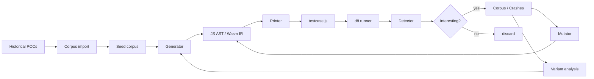

# reconfuzz Architecture

## Overview

reconfuzz is a hybrid structure-aware fuzzer for V8/Chromium. It splits work
between a TypeScript generator/mutator (fast AST and Wasm IR iteration) and a
Python runner/orchestrator (process management, crash detection, scheduling).
The architecture is designed for **reconstructing** bug-finding strategies from
historical POCs and then **extending** them through systematic generation,
mutation, and variant analysis.

## Components

### 1. Generator (`src/generator/`)

Produces a `ReconfuzzProgram` object containing:

- `javascript`: a Babel AST representing the JS harness + stressor.
- `wasm`: an array of `WasmModule` descriptors encoded by the self-contained
  `wasm-builder.ts`.
- `flags`: a list of V8 flags required by the generated features.
- `includes`: helper scripts to load.

The generator has four modes:

- `js-only`: pure JavaScript grammar.
- `wasm-only`: JS↔Wasm wrapper and tiering templates.
- `gc-only`: garbage-collector stress templates.
- `hybrid`: combines JS grammar with Wasm and GC templates.

### 2. Mutator (`src/mutator/`)

Operates on the AST/IR rather than raw text to preserve syntactic validity:

- `ast-mutators.ts`: splice, operator substitution, edge-value injection,
  wrapper insertion.
- `wasm-mutators.ts`: section reorder, LEB128 corruption, opcode flip,
  custom-section payload changes.
- `minimizer.ts`: delta-debugging on the AST to remove statements while
  preserving the crash signature.

### 3. Printer (`src/generator/printer.ts`)

Emits:

- A `// Flags:` header if flags are present.
- `d8.file.execute` includes for helpers.
- The JavaScript source via `@babel/generator`.
- Inline Wasm `Uint8Array` payloads.

### 4. Runner (`src/runner/`)

Python modules:

- `d8_wrapper.py`: spawn `d8`, enforce timeout, capture stdout/stderr/return
  code, kill stale processes.
- `detector.py`: classify output into crash type, sanitizer category,
  V8-specific signature, and stable stack hash.
- `corpus_manager.py`: load/save seeds, track metadata, deduplicate by stack
  hash.
- `scheduler.py`: AFL-style energy assignment, coverage novelty
  prioritization.
- `harness.py`: high-level `run_source` / `evaluate` API.

### 5. Harness helpers (`harness/v8-helpers.js`)

Stubs and helpers expected by generated testcases:

- `assertEquals`, `assertThrows`, `gc()`
- Common d8 natives such as `%PrepareFunctionForOptimization`,
  `%ArrayBufferDetach`, `%WasmTriggerCodeGC`
- `Sandbox.MemoryView`, `Sandbox.getAddressOf`
- `WasmModuleBuilder` constants and opcode helpers

### 6. Scripts (`scripts/`)

- `fuzz.py`: main continuous fuzzing loop.
- `fuzz_gc.py`: GC-focused continuous loop.
- `import_corpus.py`: import external POC directories.
- `reproduce.py`: run a single testcase and classify.
- `setup_v8.py`: download and build V8 from source.

## Data flow

1. Historical POCs are imported into the seed corpus by `import_corpus.py`.
2. Scheduler selects a seed, or the generator produces a fresh program.
3. Mutator applies one or more structure-aware mutations.
4. Printer emits `testcase.js`.
5. Runner executes the testcase under `d8` with sampled flags.
6. Detector parses the result.
7. Interesting results are saved; coverage-increasing results are added to the
   corpus.
8. Variant analysis uses saved crashes to drive new targeted generation.

## Design principles

- **Reconstruction first**: every template and grammar rule is grounded in a
  pattern observed in `big_sleep` or `jshitter`.
- **Structure awareness**: mutation happens on AST/IR, not bytes, keeping
  programs executable.
- **Subsystem coverage**: JS parser, bytecode, Maglev, TurboFan/Turboshaft,
  Wasm Liftoff/TurboFan, GC, and sandbox are all reachable.
- **Variant scalability**: crashes are deduplicated by stack hash and can be
  re-fed into the generator for targeted campaigns.

## Extensibility

- Add new AST production rules in `src/generator/js-grammar.ts`.
- Add new Wasm sections/opcodes in `src/generator/wasm-builder.ts`.
- Add new GC templates in `src/generator/gc-templates.ts`.
- Add new JS↔Wasm glue in `src/generator/js-wasm-glue.ts`.
- Add new detectors in `src/runner/detector.py`.
- Add new mutation strategies in `src/mutator/`.
- Add new scripts in `scripts/`.
